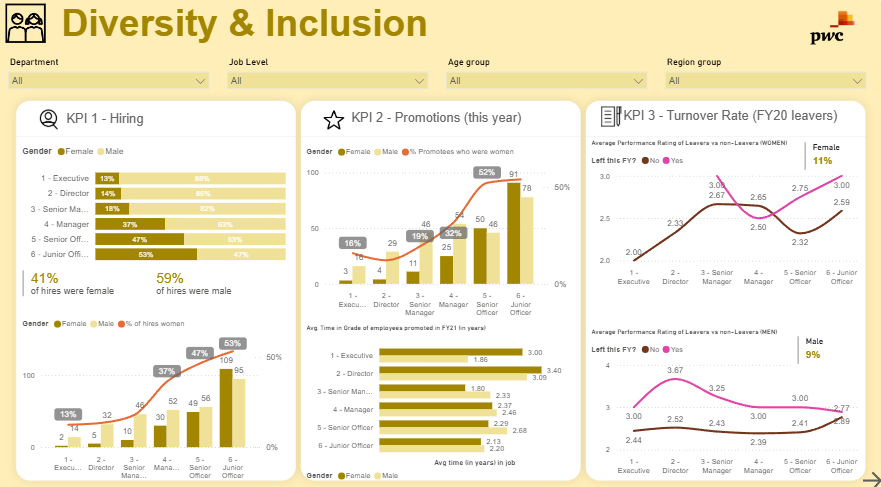
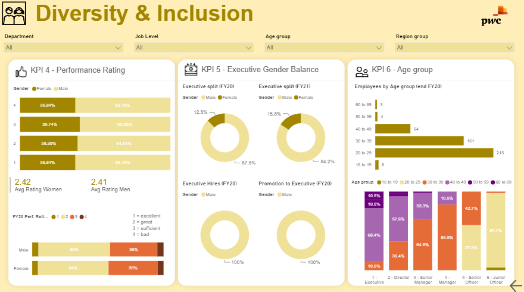

# PwC Switzerland — Power BI Job Simulation

> Three executive Power BI dashboards built during the **PwC Switzerland Power BI Job Simulation (Forage)** — **Call Centre Trends**, **Customer Retention**, and a two-page **Diversity & Inclusion** analysis — each turning a client dataset into a clear, decision-ready story.


> ℹ️ **Context:** Completed as part of the **PwC Switzerland Power BI virtual job simulation** on Forage. Each task mirrors a real PwC engagement: interpret a client brief, model the data, and communicate what it means.

### 📥 Power BI Files
- [**Diversity & Inclusion (.pbix)**](pwc/Diversity_%26_Inclusion.pbix)
- [**Call Centre Trends (.pbix)**](pwc/Call_Centre_Trends.pbix)
- [**Customer Retention (.pbix)**](pwc/Customer_Retention.pbix)

---

## 📊 Tasks in this Repository

| # | Task | Focus |
|---|---|---|
| 1 | **Call Centre Trends** | Call volume, answer/reject rates, agent & topic performance |
| 2 | **Customer Retention** | Churn / retention drivers and customer behaviour |
| 3 | **Diversity & Inclusion** | Six D&I KPIs across the employee lifecycle *(detailed below)* |

---

## ⭐ Featured: Diversity & Inclusion Dashboard

A two-page executive dashboard analysing **six Diversity & Inclusion KPIs** — hiring, promotions, turnover, performance, executive gender balance and age profile — to help leadership track and improve gender representation.




### 🎯 Business Problem
Leadership wanted an evidence-based answer to: *"Are we treating and advancing women equitably — and if not, where does the pipeline break?"* Gut feel and scattered HR reports couldn't say where to act.

### 📊 The Six KPIs
| KPI | Measures | Headline |
|---|---|---|
| **1 · Hiring** | Gender split of new hires by level | **41% female / 59% male** |
| **2 · Promotions** | Share of promotions to women | **32% of promotees were women** |
| **3 · Turnover** | Leaver rate by gender (FY20) | **Female 11% vs Male 9%** |
| **4 · Performance** | Avg performance rating by gender | **Women 2.42 vs Men 2.41** |
| **5 · Executive Gender Balance** | Female share of executives | **12.5% (FY20) → 15.8% (FY21)** |
| **6 · Age Profile** | Workforce by age group & level | concentrated in **20–39** |

### 💡 Key Insight — the "leaky pipeline"
The six KPIs tell one connected story:

- **Women are hired and perform equally** — 41% of hires are female and average ratings are effectively identical (2.42 vs 2.41). **No performance gap** explains what follows.
- **But representation collapses with seniority** — female hiring share falls from **53% at Junior Officer to ~13% at Executive**, only **32% of promotions** go to women, and executives are just **12.5–15.8% female**.
- **And women leave at a higher rate** — FY20 turnover is **11% for women vs 9% for men**.
- **Executive hires and promotions were 100% male in FY20** — the top of the pipeline isn't refilling with women.

**So what:** the problem isn't *hiring* women or their *performance* — it's **retention and advancement at senior grades**. The dashboard points leadership straight at promotion equity and mid-senior retention as the levers that move executive gender balance.

---

## 🛠️ Tech Stack

- **Power BI Desktop** — multi-page reports with cross-page slicers
- **DAX** — measures for ratios, promotion/turnover rates, averages, YoY comparisons
- **Data modelling** — over the HR / call-centre / retention datasets
- **Root cause analysis** — connecting KPIs into a single narrative

---

## 🧰 Skills Demonstrated

`Power BI` · `DAX measures` · `HR / People analytics` · `Customer analytics` · `KPI design` · `Executive dashboard design` · `Root cause analysis` · `Data storytelling` · `Diversity & inclusion metrics`

---

## 🗂️ Repository Structure

```
PwC_Switzerland_Power-BI_2024/
├── README.md
└── pwc/
    ├── assets/
    │   ├── diversity_inclusion_1.png   # page 1: hiring, promotions, turnover
    │   └── diversity_inclusion_2.png   # page 2: performance, exec balance, age
    ├── Diversity_&_Inclusion.pbix
    ├── Call_Centre_Trends.pbix
    └── Customer_Retention.pbix
```

---

## 🚀 Future Improvements

- **Target lines** on each KPI (e.g., 40% female executives) with gap-to-target indicators.
- **Cohort retention** — track a hiring cohort's promotion/attrition over time.
- **Department drill-through** to find where the pipeline leaks most.

---

<p align="center">
  <strong>Abilash K S</strong> · Business & Data Analyst<br>
  <a href="https://portfolio-abilash-ks.vercel.app/">Portfolio</a> ·
  <a href="https://www.linkedin.com/in/abilash-k-s/">LinkedIn</a> ·
  <a href="mailto:abilash.connect@zohomail.in">Email</a>
</p>
